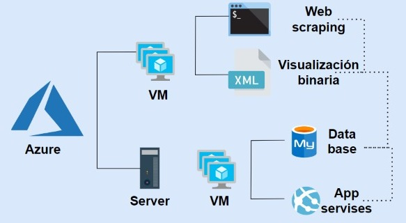

# Log4j.

# Análisis de anomalías cibernéticas con inteligencia artificial. #

Durante la época vacacional decembrina un problema muy común es el robo de información por diferentes métodos, uno de los más comunes es el phishing así como también el spoofing, el problema radica en el usuario desconoce acerca la seguridad en internet y la forma en que los ciberdelincuentes operan, por lo tanto, es difícil reconocer cuando están siendo atacados.

Es por esto que Log4j da una solución por medio de:

  -	Análisis de páginas web por medio de recuperación de datos con web scraping, convirtiendo binarios a imagen y siendo comparados por IA entrenada.
  
  -	Aplicación web con identificación mediante análisis de patrones en imágenes. :newspaper:
  
      -	Búsqueda de patrones en páginas web maliciosas.
      
      -	Tráfico de dominios maliciosos o falsos.
      
        -	Ataques:
        
          -	Seguridad de dominios.
          
           -	Phishing.
           
 ### Titk tok. ###
 <a href="https://vm.tiktok.com/ZM83UQJ7y/">Link a tik tok</a>
 
 ### Diagrama. ###
 
 
 
 ### SLA. ### 
 
 99.25%
 
 ### TCO. ### 
 
  A tres años $11,212 USD.
 
  Precio total por mes: $521.96 USD.
  
 ## Herramientas. ##
- Azure Cognitive Services.
- Azure Virtual Machine.
- Github.
- Azure MySQL.
- Azure App Services.
- Binvis.
- Visual Studio Code.

## Escalabilidad #
-	Diferentes tipos de ataques.
-	Facilidad de crecimiento.
-	Chatbot (dudas y explicación).
-	Análisis de correos electrónicos maliciosos.
-	Alto porcentaje de confiabilidad.
-	Foros y soporte.
-	Validación de no repudiación.

 ## Tiempo sin disponibilidad de a un año. ##
 2d 17h 44m 37s
 
 ## Evento. ##
 
Evento bastante entretenido, divertido, con un cast que se preocupaba por que entregaras tu proyecto, lleno de conocimientos y aventuras por descubrir en el mundo de azure como de la computación, inteligencia artificial y falta de horas de sueño.
